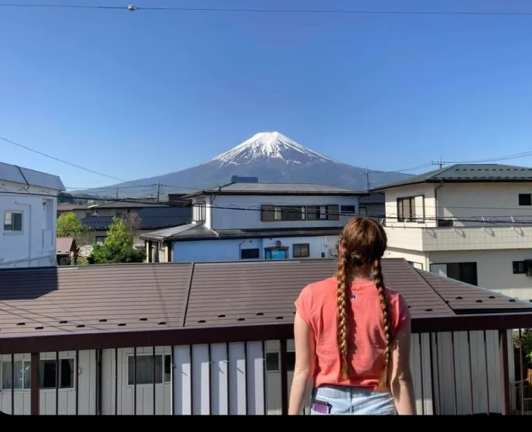

# Travel Destinations

## Food, Scenery, and Places I Have Been

This webpage is about my travel experiences. I will share places I have visited, food I have tried, beautiful views, and my ratings of different destinations.

## Reflection

I am feeling more confident with the skills I have practiced so far. I have learned more about HTML, CSS, navigation menus, file paths, and using GitHub to publish my website.

I would like more practice with CSS and Git commands because I am still getting used to how they work. I would also like more clarification on how to organize files and make sure everything connects correctly.
Using components and classes helped me organize my webpage because I could group similar sections together and style them the same way. For example, I used the same class for my travel cards, which made it easier to keep the layout consistent without writing different CSS for each card. I would like feedback on what I could add or what you think would be a good thing to add to my webpage.